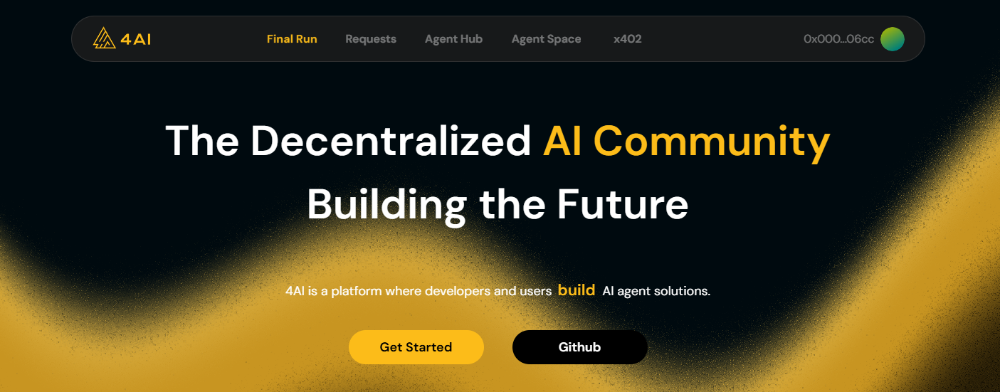

4BSC AI Automation

==================

Automates the daily 4BSC AI tasks: signs in with a wallet, checks the daily quota, uses an AI model to generate agent/request, and registers new agents/requests on-chain via a BSC contract.

## No account ?
- register 4bsc ai [https://4bsc.ai/](https://4bsc.ai/final-run?invite_by=tr0N74) (use new wallet).

Quick Start
-----------
```
git clone https://github.com/WongFadhil/4bscaiBot.git
cd 4bscaiBot
```

1. Install deps: `npm install`
2. Configure `.env` (see below).
3. Run the bot: `npm run start`

Required Environment
--------------------
```
cp .env-example .env
nano .env
```
- `PRIVATE_KEY`: EVM private key used to sign and send contract txs.
- `API_KEY`: Token for AI text generator ypu can use mine for free.
- or get one here [https://enter.pollinations.ai/](https://enter.pollinations.ai/)

What It Does
------------
- Wallet auth: signs it with `PRIVATE_KEY`, then logs in to get a session token.
- Daily check: calls the verify endpoint; if no agent/request exists for the day, it proceeds.
- AI generation: asks AI to produce either an agent spec or request details.
- API write: posts the generated agent/request to 4bsc.ai.
- On-chain registration: if an ID is returned, sends a BSC transaction to record it on the contract.
- Scheduling: repeats the cycle every 12 hours to catch daily tasks.

How to Run Safely
-----------------
- Fund the `PRIVATE_KEY` wallet with enough BNB for gas on BSC.
- Keep `.env` private; never commit secrets.
- Monitor logs in the terminal; errors are printed with a simple color logger.


Notes
-----
- Ctrl+C when you want to stop the bot.

-------


This project is licensed under the MIT License - see the [LICENSE](LICENSE) file for details.

Copyright © 2026 ZLKCYBER
